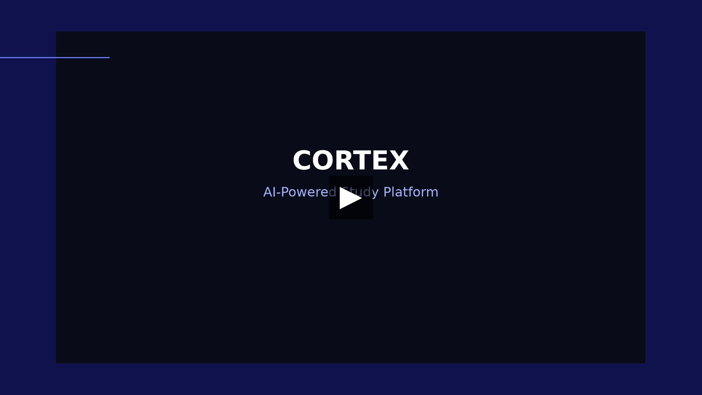
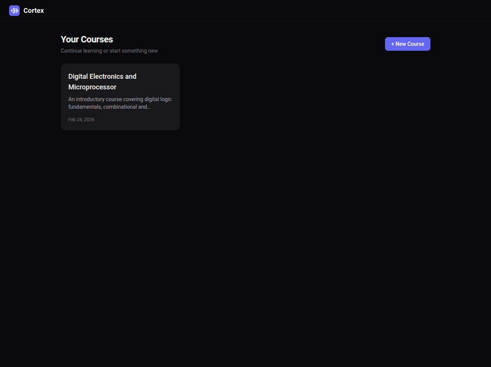
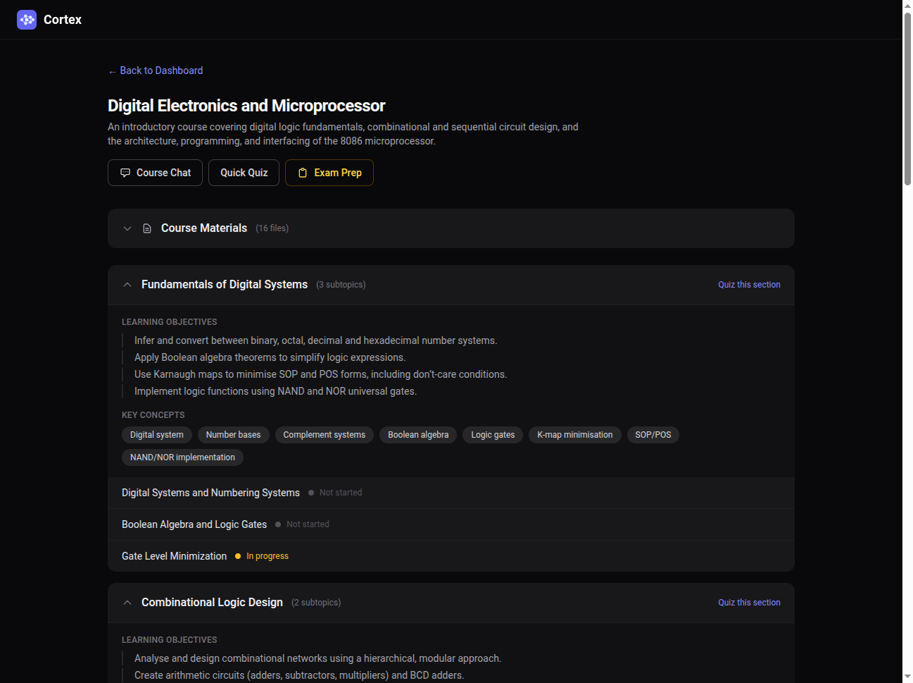
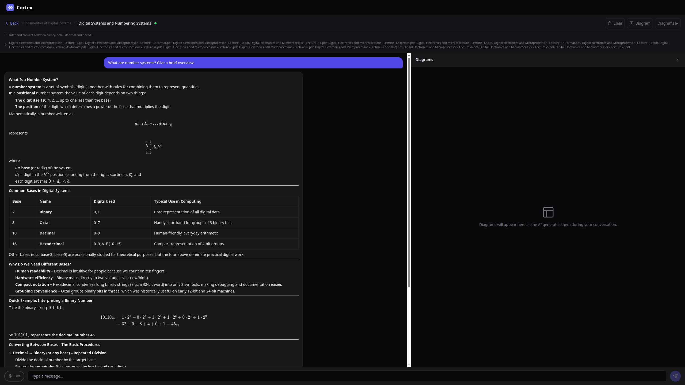
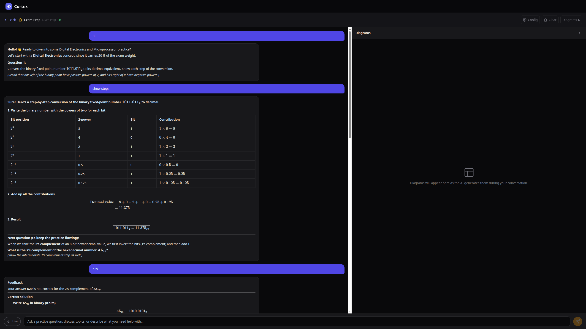

# Cortex

AI-powered study platform that turns your course materials into an interactive tutor with voice chat, diagrams, quizzes, and exam prep.

Upload a PDF or paste your syllabus. Cortex chunks it, embeds it, and lets you have a real-time conversation about any topic — with voice, LaTeX math rendering, auto-generated diagrams, and retrieval-augmented context from your own materials.

[](https://github.com/Aadilhassan/cortex-ai-powred-STEM-learning/releases/download/v1.0/cortex_intro.mp4)









---

## Why

Studying from dense PDFs and lecture notes is slow. You read, re-read, highlight, forget. What if you could just *talk* to your materials?

Cortex gives you a tutor that:
- **Knows your content** — RAG pipeline retrieves the most relevant chunks from your uploaded materials for every question
- **Speaks back** — real-time voice mode with speech-to-text and text-to-speech, so you can study hands-free
- **Draws diagrams** — auto-generates Mermaid flowcharts, sequence diagrams, and more when visual explanation helps
- **Tests you** — generates quizzes and exam prep at any scope (course, section, or subtopic)
- **Renders math** — full LaTeX/KaTeX support for STEM subjects

## Who it's for

- Students preparing for exams who want an interactive way to review
- Self-learners working through technical material (CS, math, engineering, sciences)
- Anyone who learns better through conversation than passive reading

---

## Features

**Course Management**
- Upload PDFs, PowerPoints, text files, or VTT subtitles
- Auto-extracts course structure (sections, subtopics) using LLM
- Upload additional materials anytime for richer context

**AI Tutoring Chat**
- Real-time WebSocket streaming with markdown rendering
- RAG-powered — retrieves relevant chunks from your materials via vector search
- LaTeX math rendering (KaTeX) for STEM content
- Source attribution — see which material each answer draws from

**Voice Mode**
- Push-to-talk or continuous voice input
- Groq Whisper STT with silence detection (1.2s endpoint)
- Real-time TTS playback (Groq Orpheus)
- Shorter, punchier responses optimized for conversational flow

**Diagrams**
- Auto-generated Mermaid diagrams during conversation
- On-demand diagram generation for any topic
- Dedicated diagram panel alongside chat

**Quizzes & Exam Prep**
- Generate quizzes at course, section, or subtopic level
- MCQ, short answer, and diagram-based questions
- Difficulty distribution: 30% easy, 50% medium, 20% hard
- LLM-graded answers with feedback
- Dedicated exam prep workspace with resource uploads

**Progress Tracking**
- Per-subtopic status (not started / in progress / completed)
- Course-wide progress overview

---

## Architecture

```
Browser (localhost:3000)
        │
   Nginx reverse proxy
   ┌────┴─────────────┐
   │                  │
FastAPI (8000)    Astro SSR (4321)
   │
   ├── SQLite + Vector Store (NumPy)
   ├── Groq API (LLM, TTS, STT)
   └── OpenRouter API (Embeddings, Diagram LLM)
```

**Chat flow**: User sends message → embed query → vector search for relevant chunks → build context (system prompt + RAG chunks + message history) → stream LLM response → detect sentences → TTS each sentence → send audio + text deltas over WebSocket.

**RAG pipeline**: Upload → extract text (PyMuPDF/python-pptx) → chunk (500 words, 50-word overlap) → embed via OpenRouter → store in SQLite as float32 blobs → cosine similarity search at query time.

No external vector database. Everything runs in SQLite + NumPy.

---

## Tech Stack

| Layer | Technology |
|-------|-----------|
| Frontend | Astro 5 + React 19 + Tailwind CSS |
| Backend | FastAPI + Python 3.12 (async) |
| Database | SQLite (aiosqlite) |
| Vector Search | NumPy cosine similarity + SQLite blob storage |
| LLM | Groq (`openai/gpt-oss-120b`) |
| Diagram LLM | OpenRouter (`deepseek/deepseek-v3.2`) |
| Embeddings | OpenRouter (`qwen/qwen3-embedding-8b`) |
| TTS | Groq Orpheus (`canopylabs/orpheus-v1-english`) |
| STT | Groq Whisper (`whisper-large-v3-turbo`) |
| Markdown | Marked + KaTeX + Mermaid |
| Deployment | Docker Compose + Nginx |

---

## Getting Started

### Prerequisites

- Docker & Docker Compose
- [Groq API key](https://console.groq.com/) (free tier works)
- [OpenRouter API key](https://openrouter.ai/) (for embeddings and diagram generation)

### Setup

```bash
git clone <repo-url>
cd study-pal

# Configure API keys
cp backend/.env.example backend/.env
# Edit backend/.env:
#   GROQ_API_KEY=gsk_...
#   OPENROUTER_API_KEY=sk-or-v1-...

# Start everything
docker compose up --build
```

Open **http://localhost:3000**.

### First steps

1. Click **New Course** on the dashboard
2. Upload a PDF or paste your syllabus text
3. Wait for processing (text extraction + chunking + embedding)
4. Navigate into a subtopic and start chatting
5. Try voice mode by clicking the **Live** button
6. Generate a quiz from any course, section, or subtopic

---

## Project Structure

```
study-pal/
├── docker-compose.yml
├── nginx/nginx.conf            # Reverse proxy (:3000 → backend/frontend)
│
├── backend/
│   ├── app/
│   │   ├── main.py             # FastAPI app, service initialization
│   │   ├── config.py           # Model names, API URLs, chunk settings
│   │   ├── database.py         # Async SQLite (12 tables)
│   │   ├── routers/            # REST + WebSocket endpoints
│   │   │   ├── courses.py      # Course CRUD, file upload
│   │   │   ├── chat.py         # WebSocket chat (subtopic/course/exam)
│   │   │   ├── quiz.py         # Quiz generation and grading
│   │   │   ├── exam.py         # Exam prep workspace
│   │   │   ├── diagrams.py     # On-demand diagram generation
│   │   │   └── progress.py     # Progress tracking
│   │   └── services/           # Business logic
│   │       ├── llm_client.py       # OpenAI-compatible LLM wrapper
│   │       ├── embedder.py         # Embedding API client
│   │       ├── vector_store.py     # Cosine similarity search
│   │       ├── conversation.py     # RAG context building, streaming
│   │       ├── tts_engine.py       # Groq Orpheus TTS
│   │       ├── stt_engine.py       # Groq Whisper STT
│   │       ├── handout_processor.py # PDF/PPTX/VTT text extraction
│   │       ├── quiz_generator.py   # Quiz/exam question generation
│   │       └── diagram_service.py  # Mermaid diagram generation
│   └── data/                   # SQLite database (persisted via Docker volume)
│
└── frontend/
    └── src/
        ├── layouts/Layout.astro
        ├── pages/              # File-based routing
        ├── components/         # React components
        │   ├── StudyView.tsx       # Main tutoring interface
        │   ├── ChatPanel.tsx       # Message rendering, markdown, KaTeX
        │   ├── DiagramPanel.tsx    # Mermaid diagram display
        │   ├── CourseChat.tsx      # Course-level chat
        │   ├── ExamPrep.tsx        # Exam prep interface
        │   ├── QuizView.tsx        # Quiz rendering and submission
        │   └── LiveModeButton.tsx  # Voice mode toggle
        └── lib/
            ├── api.ts          # REST client
            └── websocket.ts    # WebSocket with auto-reconnect
```

---

## Configuration

All config lives in `backend/app/config.py`. Key settings:

| Setting | Default | Description |
|---------|---------|-------------|
| `PRIMARY_MODEL` | `openai/gpt-oss-120b` | Main conversation LLM (via Groq) |
| `DIAGRAM_MODEL` | `deepseek/deepseek-v3.2` | Diagram generation LLM (via OpenRouter) |
| `EMBEDDING_MODEL` | `qwen/qwen3-embedding-8b` | Text embedding model |
| `CHUNK_SIZE` | `500` | Words per chunk for RAG |
| `CHUNK_OVERLAP` | `50` | Word overlap between chunks |

Swap models by editing `config.py` — the LLM client uses the OpenAI-compatible API format, so any provider that supports it works.

---

## Ports

| Port | Service |
|------|---------|
| 3000 | Nginx (public entry point) |
| 8000 | FastAPI backend |
| 4321 | Astro frontend |

---

## License

MIT
